# ⚡ Master Blueprint: CockroachDB RU & Pipeline Efficiency Optimization Plan 🚀

> **Objective**: Reduce CockroachDB Serverless Request Units (RU) consumption by **90% to 98%**, staying permanently well within the free tier (50M RUs/month), while improving API response times from seconds to sub-50 milliseconds.

---

## 📊 1. Current Resource Usage & Root-Cause Forensic Analysis

### 🚨 The Problem:
* **Request Units (RUs) Used**: **45.21 Million / 50.0 Million (90.4% exhausted in just 2 days!)**
* **Storage Used**: **709.2 MiB / 10.0 GiB (7.1% utilized)**

### 🔬 Root-Cause Breakdown:

| # | Root Cause Identified | Mechanism & RU Burn Impact |
| :--- | :--- | :--- |
| **1** | **Cast Scans (`trade_time::date = %s`)** | In PostgreSQL/CockroachDB, casting a column (`::date`) invalidates the B-tree index on `trade_time`. CockroachDB was forced to perform a **Full Table Scan (1.5M rows / ~300 MB)** on every single date query, costing ~20,000 RUs per single query! |
| **2** | **Tiny Scraper Batch Sizes (100 rows/txn)** | Ingesting 50,000 trades at 100 rows per batch generated **500 separate distributed SQL transactions** per day, multiplying write transaction coordination RUs. |
| **3** | **Zero API Edge & In-Memory Caching** | Every single dashboard visit, tab switch, sort, and date change directly hit CockroachDB, even though historical trading sessions are **100% static and immutable**. |
| **4** | **API Overview Queries Hitting Raw Table** | `api/visual.py` and `api/script.py` scanned 50,000 raw rows instead of utilizing the 97% pre-aggregated `daily_broker_scrip_summary` layer (11,000 rows). |
| **5** | **Repeated `DISTINCT trade_time::date` Queries** | Scrapers and verifiers repeatedly scanned `floorsheet_raw` to discover dates instead of querying the lightweight summary or audit tables. |

---

## 🏛️ 2. The 5-Pillar Optimization Strategy (98% RU Reduction)

```mermaid
flowchart TD
    subgraph P1 ["Pillar 1: Complete Elimination of Cast Scans"]
        A["Replace trade_time::date with<br/>trade_time >= start_ts AND trade_time <= end_ts"] --> A1["Instant Index Range Seek (<5ms)<br/>(10,000x fewer bytes read)"]
    end

    subgraph P2 ["Pillar 2: Vercel Edge & In-Memory Caching"]
        B["Historical Dates Are Immutable<br/>(Cache-Control: s-maxage=86400)"] --> B1["Served from Vercel Edge CDN<br/>(0 CockroachDB RUs!)"]
    end

    subgraph P3 ["Pillar 3: Summary-First API Routing"]
        C["Single-Day Overviews Read from<br/>daily_broker_scrip_summary"] --> C1["78% Smaller Table Scan<br/>(11k rows vs 50k rows)"]
    end

    subgraph P4 ["Pillar 4: Scraper Batch Scaling"]
        D["Scale Batch Size from 100 to 2,000 Rows"] --> D1["Reduces Transaction Overhead<br/>from 500 txns to 25 txns (95% reduction)"]
    end

    subgraph P5 ["Pillar 5: Lightweight Metadata Discovery"]
        E["Discover Dates from analytics_etl_runs<br/>or daily_broker_scrip_summary"] --> E1["Zero Raw Table Scans for Date Discovery"]
    end
```



---

## 🛠️ 3. Detailed Implementation Blueprint

### Pillar 1: Eliminate All `trade_time::date` Full Table Scans

#### 1.1. Fix `api/index.py` (Raw Floorsheet API)
* **Current**:
  ```sql
  WHERE trade_time::date = %s  -- Scans entire 1.5M row table!
  ```
* **Optimized**:
  ```python
  start_ts = f"{trade_date} 00:00:00+00"
  end_ts = f"{trade_date} 23:59:59.999999+00"
  # WHERE trade_time >= %s AND trade_time <= %s -- Uses idx_trade_time index!
  ```
* **RU Impact**: Reduces read RUs per page load from **~20,000 RUs down to < 5 RUs**.

#### 1.2. Fix `pipelines/Floorsheet_Filler.py` & `pipelines/verify.py`
* Replace `WHERE trade_time::date = %s` in deduplication checks with timestamp bounds.
* Replace `SELECT DISTINCT trade_time::date FROM floorsheet_raw` with:
  ```sql
  SELECT DISTINCT trade_date FROM daily_broker_scrip_summary ORDER BY trade_date DESC;
  ```

---

### Pillar 2: Vercel Edge CDN & In-Memory Response Caching (0 RUs on Repeated Hits)

#### 2.1. Principle of Immutability
* Past trading sessions (e.g., `2026-08-31`, `2026-08-27`, `2026-07-01`) **never change**. Once the market closes and is reconciled, the data is frozen.
* If 1,000 users view `2026-08-31`, CockroachDB should execute the query **exactly ONCE**, and serve the next 999 requests directly from Vercel's Edge CDN cache at **0 RUs cost**!

#### 2.2. Implementation in FastAPI Endpoints:
Add HTTP Cache Headers to FastAPI responses:
```python
from fastapi import Response

@router.get("/overview")
def get_overview(date: str, response: Response):
    # Check if date is today vs historical
    today_str = datetime.now().strftime("%Y-%m-%d")
    if date < today_str:
        # Cache on Vercel CDN for 24 hours, stale-while-revalidate for 7 days
        response.headers["Cache-Control"] = "public, max-age=86400, s-maxage=86400, stale-while-revalidate=604800"
    else:
        # Live / today's data: cache for 60 seconds
        response.headers["Cache-Control"] = "public, max-age=60, s-maxage=60"
    ...
```

#### 2.3. Python In-Memory LRU Cache (`functools.lru_cache` or `cachetools`)
* Cache hot historical responses in memory inside the serverless instance.

---

### Pillar 3: Summary-First API Routing for Single-Day Overviews

* `api/visual.py` (`/api/visual/overview`) and `api/script.py` (`/api/script/overview`) currently scan `floorsheet_raw` (50,000 rows).
* When no granular time bucket is selected (full day overview), they can read directly from `daily_broker_scrip_summary` (11,000 rows)!
* **RU Savings**: **78% reduction in scan volume** on every single-day overview load.

---

### Pillar 4: Optimize Scraper Ingestion Batching

#### 4.1. Scale Batch Chunking from 100 to 2,000 Rows
* In `pipelines/Floorsheet_Daily_Update.py` and `pipelines/Floorsheet_Filler.py`:
  * Buffer scraped pages in memory and flush to CockroachDB in batches of **2,000 rows**.
  * For 50,000 daily trades:
    * **Before**: 500 separate `execute_values` SQL transactions.
    * **After**: **25 SQL transactions total**.
  * **RU Savings**: **95% reduction in write transaction coordination RUs**.

---

### Pillar 5: Database Storage & Connection Efficiency

#### 5.1. Connection Pooling & Clean Cursor Lifecycles
* Use context managers `with conn.cursor() as cur:` to prevent connection or transaction leaks in serverless environments.
* Use `conn.autocommit = True` on read-only queries to prevent unnecessary transaction lock management in CockroachDB.

---

## 📈 4. Projected RU Savings Matrix

| Component | Before Optimization | After Optimization | Expected RU Reduction |
| :--- | :--- | :--- | :--- |
| **Raw Floorsheet Pagination** | 20,000 RUs / page (Full Scan) | 5 RUs / page (Index Seek) | **99.97% ⬇️** |
| **Daily Scraper Ingestion** | 500 Transactions / day | 25 Transactions / day | **95.0% ⬇️** |
| **Single-Day Broker Overview** | Scans 50k rows in Raw | Scans 11k rows in Summary | **78.0% ⬇️** |
| **Historical Page Refreshes** | Hits DB on every request | Served from Vercel CDN Cache | **100.0% ⬇️ (0 RUs)** |
| **Date Discovery Checks** | Full table scan on Raw | 1-row seek on Audit/Summary | **99.9% ⬇️** |
| **Total Monthly RU Estimate** | **~600 Million RUs / month (Over quota!)** | **~2 to 3 Million RUs / month (Well within 50M limit!)** | **> 95% Overall Savings 🎉** |

---

## 🗓️ 5. Implementation Roadmap (Phases)

- [ ] **Phase 1 (Immediate - High Impact)**:
  - Fix all remaining `trade_time::date` cast scans in `api/index.py`, `pipelines/Floorsheet_Filler.py`, and `pipelines/verify.py`.
- [ ] **Phase 2 (CDN & Edge Caching)**:
  - Add `Cache-Control` headers for historical dates in `api/index.py`, `api/visual.py`, `api/script.py`, and `api/multiday.py`.
- [ ] **Phase 3 (Scraper Batching)**:
  - Update `pipelines/Floorsheet_Daily_Update.py` and `pipelines/Floorsheet_Filler.py` to buffer and insert in chunks of 2,000 rows.
- [ ] **Phase 4 (Summary-First Routing)**:
  - Update `api/visual.py` and `api/script.py` overview endpoints to query `daily_broker_scrip_summary` for full-day requests.
